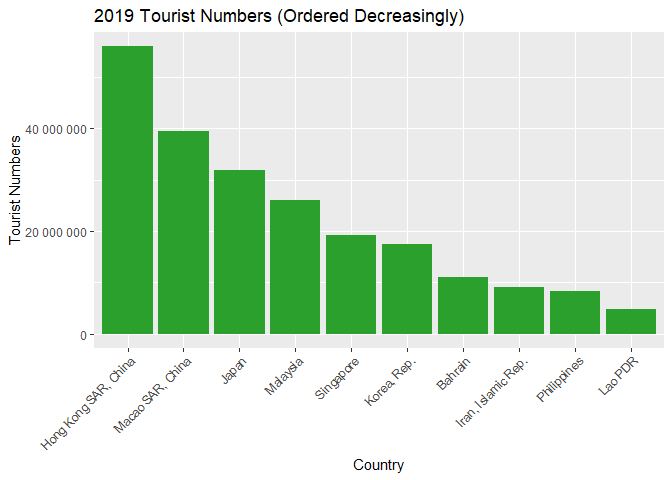
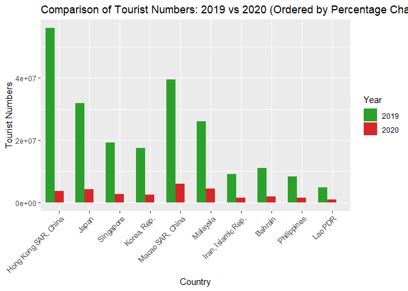
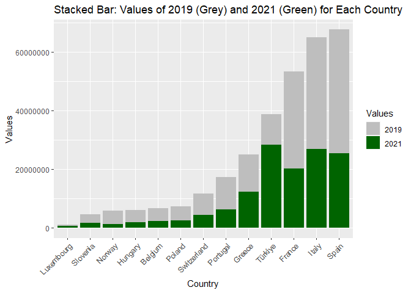

Tourism Trends During COVID-19 Pandemic
================
Hussein Hasan, Montaha Naouar, Ayhan Eray

# Research Question

How has the COVID-19 pandemic affected tourism trends around the world,
and which countries were affected the most?

# Objective of The Project

The project aims analyze how the numbers of tourism around the globe has
changed during and after the pandemic. As well as drawing conclusions
based on the trends of change among countries.

# Data Collection

- World Bank
- Organisation for Economic Co-operation and Development (OECD)

# Statistical Analysis: Which countries were affected the most?

``` r
cat("Average number of tourists in 2019:", average_2019, "\n")
```

    ## Average number of tourists in 2019: 14397388

``` r
cat("Median number of tourists in 2019:", median_2019, "\n")
```

    ## Median number of tourists in 2019: 3328000

## 

``` r
cat("Minimum number of tourists in 2019:", min_2019, "\n")
```

    ## Minimum number of tourists in 2019: 19200

``` r
cat("Maximum number of tourists in 2019:", max_2019, "\n")
```

    ## Maximum number of tourists in 2019: 217877000

## 

``` r
wb$PercentageChange <- ((wb$'2020' - wb$'2019') / wb$'2019') * 100
wb <- wb[order(wb$PercentageChange), ]
print(wb)
```

    ## # A tibble: 10 × 4
    ##    `Country Name`         `2019`  `2020` PercentageChange
    ##    <fct>                   <int>   <int>            <dbl>
    ##  1 Hong Kong SAR, China 55913000 3569000            -93.6
    ##  2 Japan                31881000 4115799            -87.1
    ##  3 Singapore            19116000 2742000            -85.7
    ##  4 Korea, Rep.          17503000 2519000            -85.6
    ##  5 Macao SAR, China     39406000 5897000            -85.0
    ##  6 Malaysia             26101000 4333000            -83.4
    ##  7 Iran, Islamic Rep.    9107000 1550000            -83.0
    ##  8 Bahrain              11061000 1909000            -82.7
    ##  9 Philippines           8261000 1483000            -82.0
    ## 10 Lao PDR               4791000  886400            -81.5

## 

<!-- -->

## 

<!-- -->

## 

<!-- -->

## 

<!-- -->

# Case Study: Turkey

## 

<!-- -->

## 

<!-- -->

## 

<!-- -->

## 

``` r
rec_per <- abs(diff_20_21) / abs(diff_19_20)
cat("Turkiye recovered", rec_per * 100, "% of the tourists it lost")
```

    ## Turkiye recovered 60.37755 % of the tourists it lost

# The Recovery Trends Around the World

<!-- -->

## 

<!-- -->

## 

<!-- -->

## 

``` r
print(oecd_pos_percentages)
```

    ## # A tibble: 13 × 4
    ##    Country     total_2019 total_2021 percentage_2021_2019
    ##    <chr>            <dbl>      <dbl>                <dbl>
    ##  1 Belgium        6800455    2312767                 34.0
    ##  2 France        53520989   20361179                 38.0
    ##  3 Greece        25038500   12362791                 49.4
    ##  4 Hungary        6168576    1868335                 30.3
    ##  5 Italy         65010220   26903217                 41.4
    ##  6 Luxembourg     1041117     756387                 72.7
    ##  7 Norway         5879307    1435366                 24.4
    ##  8 Poland         7470546    2509832                 33.6
    ##  9 Portugal      17282626    6345330                 36.7
    ## 10 Slovenia       4701878    1832446                 39.0
    ## 11 Spain         67728214   25503869                 37.7
    ## 12 Switzerland   11817617    4390037                 37.1
    ## 13 Türkiye       38853764   28521748                 73.4
